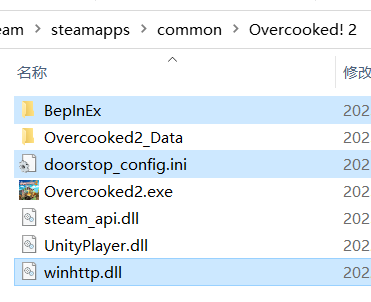

# 胡闹厨房2 - 随机模组

## 安装

1. 安装 BepInEx 5 (x86)（[GitHub](https://github.com/BepInEx/BepInEx/releases) 或 [百度网盘链接](https://pan.baidu.com/s/1G81rpJNwVsJplJi6fD2jPA?pwd=lobe)），解压后拷贝到游戏根目录下

   

       
   

   > 开启 `BepInEx` 的控制台可能会导致无法以手柄进入游戏。确保配置文件 `BepInEx/config/BepInEx.cfg` 中 `[Logging.Console]` 组中值为 `Enabled = false`。

2. 将 `OC2Randomizer.dll` 拷贝到 `BepInEx\plugins` 文件夹中即可

## 使用

- 在游戏主菜单设定 - MOD 中设置是否启用（默认不启用）。

- 在 `街机公开` 中模组无效。

- 只需要主机启用即生效，但如果客机不安装此模组关卡内分数更新会有延迟。

- 改动：

  > - 每过一段时间食材箱里的食材随机换位。
  > - 食材和厨具是需要成本的。
  > - 上菜后随机着火。

